# Druga projektna naloga (Docker)

## Prikaz Aplikacije
# Glavna stran aplikacije:
Na prvi strani aplikacije je prikazana karta Slovenije z barvnim prikazom povprečne hitrosti vetra za posamezno občino. Tako lahko uporabnik hitro vidi, kje so najugodnejši pogoji za postavitev vetrnih elektrarn.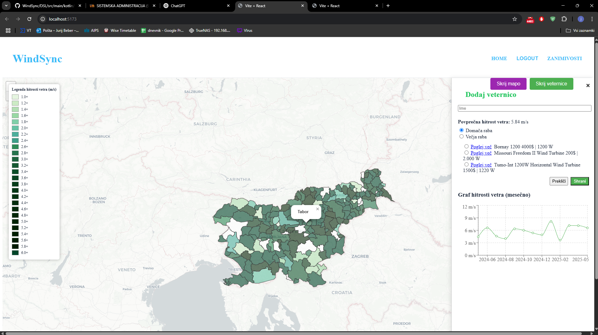

# Podstran z informacijami o vetrnici:
Ko izberemo določeno vetrnico, se prikažejo podrobni podatki o njej. Na voljo je graf, ki prikazuje, koliko energije lahko proizvedemo v posameznem mesecu skozi leto. Poleg tega aplikacija prikaže tudi oceno časa, v katerem se investicija v vetrnico povrne.
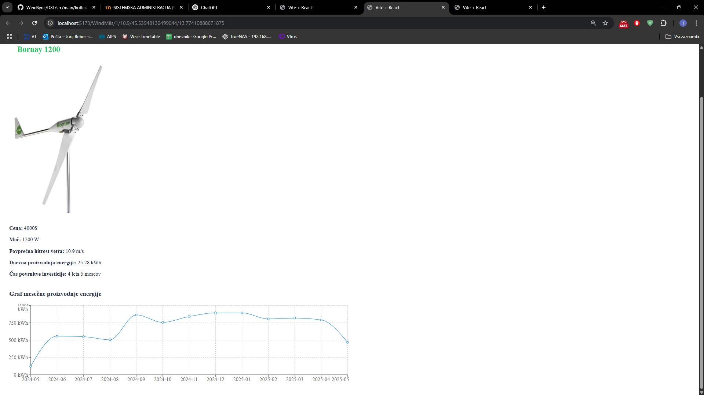

# Podstran z zanimivostmi:
Na tej podstrani lahko vidimo zanimive primerjave, koliko vetrne energije uporabljamo v Sloveniji v primerjavi z drugimi državami EU. Prikazano je, da je uporaba vetrne energije pri nas še precej nizka, kar nakazuje velik potencial za prihodnjo rast in razvoj obnovljivih virov energije.
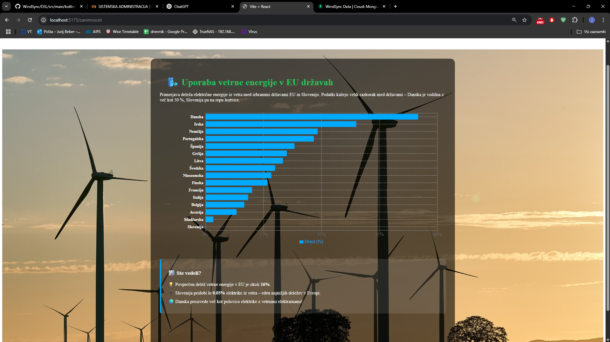


## Namestitev Dockerja

Najprej sem na svoj računalnik namestil Docker aplikacijo.
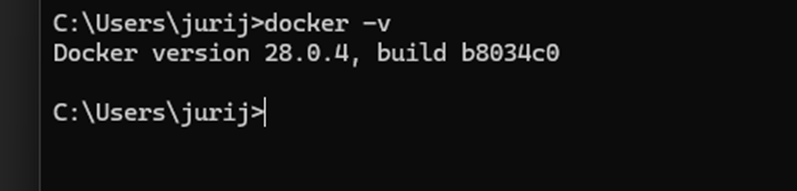

## Priprava Dockerfile za frontend

```Dockerfile
FROM node:18
WORKDIR /app
COPY package*.json ./
RUN npm install
COPY . .
EXPOSE 5173
CMD ["npm", "run", "dev"]

## Priprava Dockerfile za backend

FROM node:18
WORKDIR /app
COPY package*.json ./
RUN npm install
COPY . .
EXPOSE 3001
CMD ["npm", "start"]
```

## Priprava Docker Compose konfiguracije
Za lažji zagon obeh aplikacij sem pripravil še docker-compose.yml, ki poveže frontend in backend:

```yaml
services:
  backend:
    build: ./backend
    ports:
      - "3001:3001"
    environment:
      - NODE_ENV=production

  frontend:
    build: ./frontend
    ports:a
      - "5173:5173"
    environment:
      - NODE_ENV=development
```
## Odprava napake
Pri testiranju lokalnega zagona sem naletel na napako, ker ni bil pravilno nastavljen build za frontend. Težavo sem rešil tako, da sem v .yml datoteko dodal vrstico:
```yaml

build: ./frontend

```

## Zagon
Docker sem zagnal prek konzole z naslednjim ukazom:
```bash
docker-compose up --build
```

## Namestitev Dockerja na virtualni stroj v Azure

Nato sem se lotil dela z Dockerjem na **virtualni mašini v Azuru**. Uporabil sem naslednje ukaze za namestitev Dockerja:

### Namestitev osnovnih paketov

```bash
sudo apt install apt-transport-https ca-certificates curl software-properties-common -y

##Dodajanje GPG ključa Dockerja
curl -fsSL https://download.docker.com/linux/ubuntu/gpg | sudo gpg --dearmor -o /usr/share/keyrings/docker-archive-keyring.gpg

##Dodajanje Docker repozitorija
echo \
  "deb [arch=$(dpkg --print-architecture) signed-by=/usr/share/keyrings/docker-archive-keyring.gpg] https://download.docker.com/linux/ubuntu \
  $(lsb_release -cs) "stable" | sudo tee /etc/apt/sources.list.d/docker.list > /dev/null

##Posodobitev in namestitev Dockerja
sudo apt update
sudo apt install docker-ce docker-ce-cli containerd.io -y

## Dodajanje uporabnika v Docker skupino
sudo usermod -aG docker $USER

##Namestitev Docker Compose
sudo apt install docker-compose -y

##Preverjanje delovanja Dockerja
docker --version
docker info
```
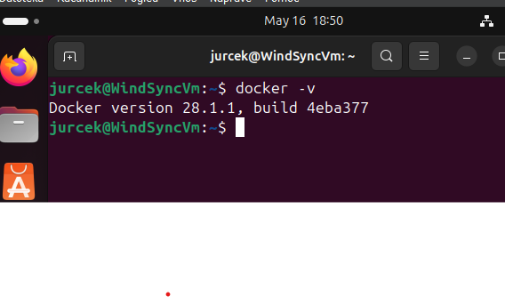

## Kloniranje projekta iz GitHub-a
Nato sem se lotil kloniranja našega projekta na virtualno mašino. Ker je projekt zaseben, sem moral ustvariti osebni dostopni žeton (token), kjer sem določil dostop do določenega repozitorija in dovoljenja.

Za kloniranje sem uporabil ukaz:
```bash
git clone https://<TOKEN>@github.com/jurcek210/WindSync.git

```
## Napaka z Atlas bazo

Pri zagonu projekta sem naletel na napako, saj aplikacija ni imela dostopa do Atlas baze. Težava je bila v tem, da sem pozabil dodati .env datoteko, ki vsebuje podatke za povezavo z bazo.

Po dodajanju .env datoteke je povezava delovala pravilno.


## Ustvarjanje Azure računa in virtualne naprave

- Uspešno sem ustvaril profil na **Azure**.
- Nato sem uspešno ustvaril **virtualno mašino** (VM).
- Mašino sem ustvaril po predloženih navodilih in zahtevanih specifikacijah.
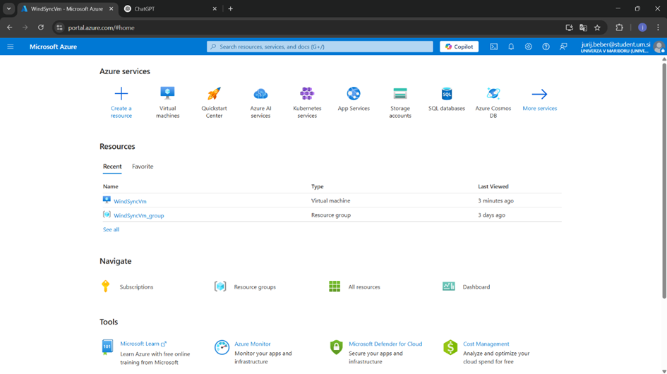
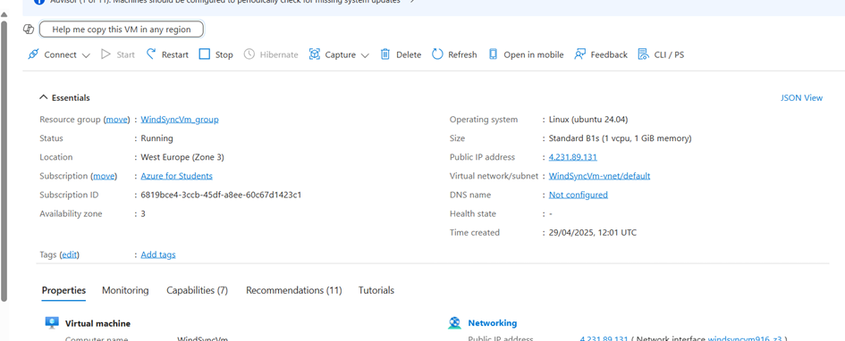


---

## Omogočanje "port forwarding"

### Kje in kako omogočimo "port forwarding"?

1. V portalu **Azure** odpri svojo virtualno napravo, v našem primeru `WindSyncVm`.
2. V levem meniju klikni na **"Networking"**, nato na **"Network settings"**.
3. Klikni **"Create port rule"**.
4. Določi:
   - **Port:** (npr. 80 za HTTP ali 3389 za RDP)
   - **Protocol:** TCP ali UDP
   - **Action:** Allow
   - **Priority:** nižja številka = višja prioriteta
   - **Name:** poljubno ime pravila
5. Klikni **"Add"**.

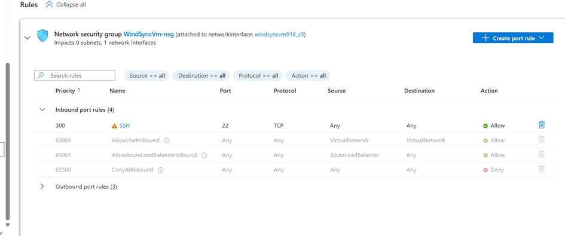


---

## Tip diska in kapaciteta

### Kakšen tip diska je bil dodan navidezni napravi in kakšna je njegova kapaciteta?

1. V portalu pojdi pod **nastavitve**, kjer izbereš **"Disks"**.
2. Prikažejo se diski – v našem primeru samo en disk.

**Podatki o disku:**
- **Tip:** Premium SSD LRS
- **Kapaciteta:** 30 GiB

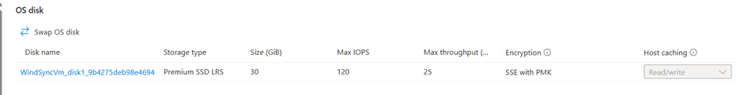


---

## Pregled porabe virov (Azure for Students)

### Kje preverimo stanje trenutne porabe virov?

Na portalu **Azure**:

1. Pojdi na **"Cost Management + Billing"**
2. V levem meniju izberi **"Overview"** v okviru svoje naročnine (npr. "Jurij Beber")

**Prikazane informacije:**
- Trenutne zaračunane vrednosti (npr. €0.33)
- Napoved porabe (Forecast)
- Top izdelki po strošku (npr. Premium SSD, IP naslov)
- Znesek za plačilo (v mojem primeru še vedno **€0.00**)

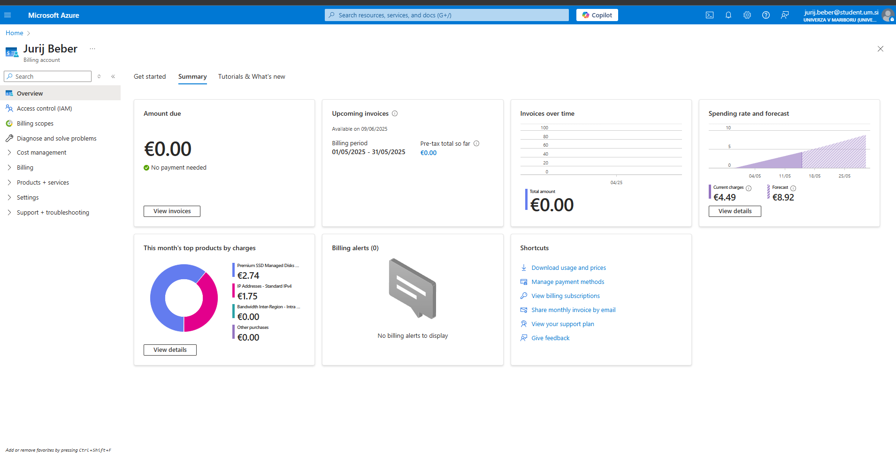


---

## Prikaz povezave na virtualni stroj

- ✅ Uspešna prijava na VM **Jurij**
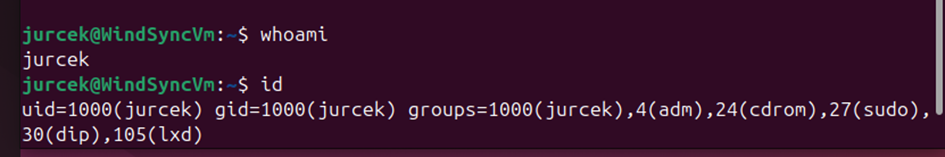

- ✅ Uspešna prijava: **Matica**
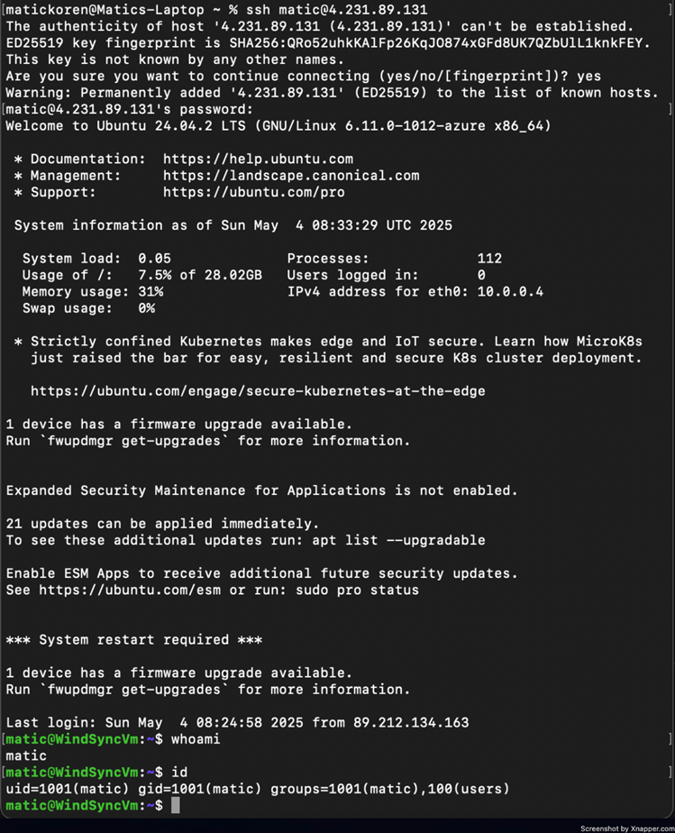

- ✅ Uspešna prijava: **Jaka**
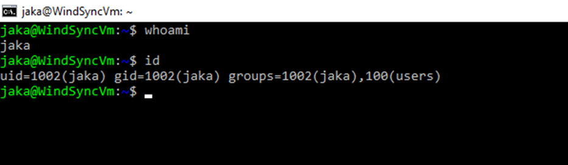
Za prijavo pa smo uporabli komando 

```bash
ssh jurcek@4.231.89.131
```

---


