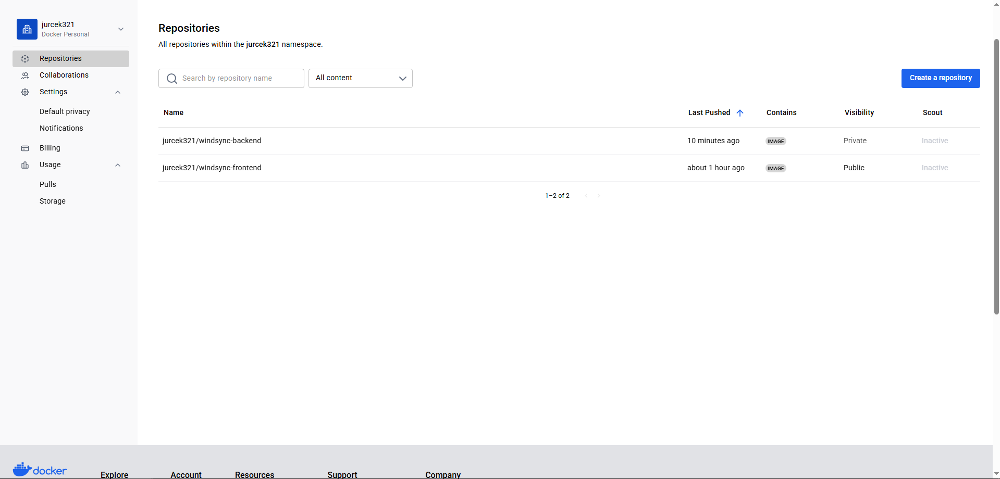
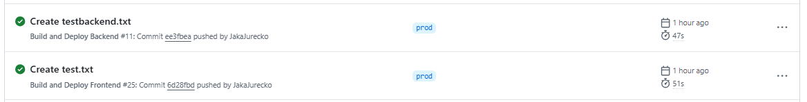
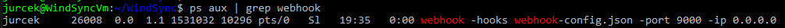
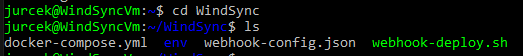

# Druga projektna naloga – CI/CD (Docker Hub, GitHub Actions, Webhook)

---

## Docker Hub container registry

### 1. Ustvarjen Docker Hub račun

Vodja mikro-skupine je ustvaril Docker Hub račun.

- Ustvarjeni sta bili dve Docker sliki:

  - **Backend**: _zasebna slika_ (private)
  - **Frontend**: _javno dostopna slika_ (public)

  

---

### 2. Uporabljeni CLI ukazi za delo z Docker registry

- `docker login` – prijava v Docker Hub iz ukazne vrstice.
- `docker build -t <ime_slike> .` – ustvari lokalno Docker sliko iz Dockerfile.
- `docker push <ime_slike>` – pošlje lokalno sliko v Docker Hub registry.
- `docker pull <ime_slike>` – prenese sliko iz Docker Hub na napravo.
- `docker-compose pull` – prenese najnovejše slike iz Docker Hub-a, definirane v `docker-compose.yml`.
- `docker-compose up -d` – zažene containere v ozadju (detached mode).
- `docker-compose down` – ustavi in odstrani vse containere definirane v `docker-compose.yml`.

---

## GitHub Actions workflows

### 1. Backend workflow `.github/workflows/backend.yml`

```
name: Build and Deploy Backend

on:
  push:
    branches:
      - prod
    paths:
      - "splet/backend/**"

jobs:
  build-and-deploy:
    runs-on: ubuntu-latest

    steps:
      - name: Checkout code
        uses: actions/checkout@v3

      - name: Docker login
        uses: docker/login-action@v2
        with:
          username: ${{ secrets.DOCKER_USERNAME }}
          password: ${{ secrets.DOCKER_PASSWORD }}

      - name: Build and Push Docker image
        uses: docker/build-push-action@v5
        with:
          context: ./splet/backend
          push: true
          no-cache: true
          tags: jurcek321/windsync-backend:latest

      - name: Webhook
        if: success()
        uses: joelwmale/webhook-action@master
        with:
          url: ${{ secrets.URL }}
          method: POST
```

---

### 2. Frontend workflow `.github/workflows/frontend.yml`

```
name: Build and Deploy Frontend

on:
  push:
    branches:
      - prod
    paths:
      - "splet/frontend/**"

jobs:
  build-and-deploy:
    runs-on: ubuntu-latest

    steps:
      - name: Checkout code
        uses: actions/checkout@v3

      - name: Docker login
        uses: docker/login-action@v2
        with:
          username: ${{ secrets.DOCKER_USERNAME }}
          password: ${{ secrets.DOCKER_PASSWORD }}

      - name: Build and Push Docker Image
        uses: docker/build-push-action@v5
        with:
          context: ./splet/frontend
          push: true
          no-cache: true
          tags: jurcek321/windsync-frontend:latest

      - name: Webhook
        if: success()
        uses: joelwmale/webhook-action@master
        with:
          url: ${{ secrets.URL }}
          method: POST
```



---

### 3. Uporabljeni GitHub Secrets

- `DOCKER_USERNAME`: Docker Hub uporabniško ime
- `DOCKER_PASSWORD`: Docker Hub geslo (oz. token)
- `URL`: webhook naslov do Azure VM, ki sproži skripto za posodobitev containerev

---

### 4. Delujoč workflow in predlogi za razširitve

#### Delujoč workflow:

Ob spremembi v mapi `backend/` ali `frontend/` se izvede ustrezen workflow, zgradi se nova Docker slika, ta se naloži na Docker Hub in nato se sproži webhook za osvežitev vsebine na produkcijskem strežniku.

#### Možnosti za dodatne workflowe:

- **Testiranje kode**: avtomatski zagon testov pred buildom (`npm test`, `jest`, `vitest`, itd.).
- **Lintanje**: preverjanje kode z ESLint ali podobnimi orodji.
- **Security checks**: skeniranje odvisnosti za ranljivosti (npr. z `npm audit`, `snyk`).
- **CI/CD za dokumentacijo**: avtomatska obnova dokumentacije (npr. Storybook, Docusaurus).
- **Notifikacije**: obvestila na Discord/Slack po uspešnem deployu.

---

## Webhook

### 1. Webhook konfiguracija (webhook-config.json)

```
[
  {
    "id": "deploy",
    "execute-command": "./webhook-deploy.sh",
    "command-working-directory": "/home/jurcek/WindSync",
    "response-message": "Webhook trigger successful."
  }
]
```

#### Pojasnilo:

- `id`: identificira URL, npr. `http://<ip>:9000/hooks/deploy`
- `execute-command`: skripta, ki se zažene ob klicu webhooka
- `command-working-directory`: mapa, kjer se izvede skripta
- `response-message`: povratno sporočilo klientu po uspešni zahtevi

### Ukaz za zagon webhook listenerja v ozadju:

```
nohup webhook -hooks webhook-config.json -port 9000 -ip 0.0.0.0 &
```

**Razlaga ukaza:**

- `nohup` – prepreči, da bi se proces prekinil, ko se terminal zapre.
- `webhook` – ukaz za zagon webhook listenerja.
- `-hooks webhook-config.json` – konfiguracijska datoteka, kjer je definirano, kaj se zgodi ob sprožitvi webhooka.
- `-port 9000` – listener bo poslušal na portu 9000.
- `-ip 0.0.0.0` – omogoči dostop do listenerja iz vseh IP naslovov (npr. interneta).
- `&` – zažene proces v ozadju (background), tako da terminal ostane prost.



---

### 2. Deploy skripta na VM (`webhook-deploy.sh`)

```
#!/bin/bash

# Ustavi trenutno zagnane containere
docker-compose down

# Prenesi najnovejše slike
docker-compose pull

# Ponovno zaženi containere
docker-compose up -d
```

---

## Docker Compose konfiguracija na Azure VM

```
services:
  backend:
    image: jurcek321/windsync-backend:latest
    ports:
      - "3001:3001"
    env_file:
      - ./env/backend.env
    environment:
      - NODE_ENV=production

  frontend:
    image: jurcek321/windsync-frontend:latest
    ports:
      - "5173:5173"
    env_file:
      - ./env/frontend.env
    environment:
      - NODE_ENV=development
```

- `image`: katero sliko naj uporabi container
- `ports`: preslikava lokalnih portov iz containera na VM
- `env_file`: konfiguracijska datoteka z okolijskimi spremenljivkami
- `environment`: dodatne spremenljivke, npr. NODE_ENV



---

## Varnostni pomisleki in zaščita webhooka

### Možne varnostne luknje:

- Webhook endpoint je nezaščiten – lahko ga sproži kdorkoli.
- Skripta ni preverjena proti IP-ju ali podpisu zahteve.

### Priporočene izboljšave:

- Dodati preverjanje `X-Auth-Token` v headerju in preveriti v skripti.
- Omejiti dostop do portov z VM firewallom (npr. samo za GitHub IP).
- Uporabiti HTTPS preko reverznega proxy strežnika (npr. Nginx).
- Spremljati dnevnike in obvestila o vsakem sproženju.
